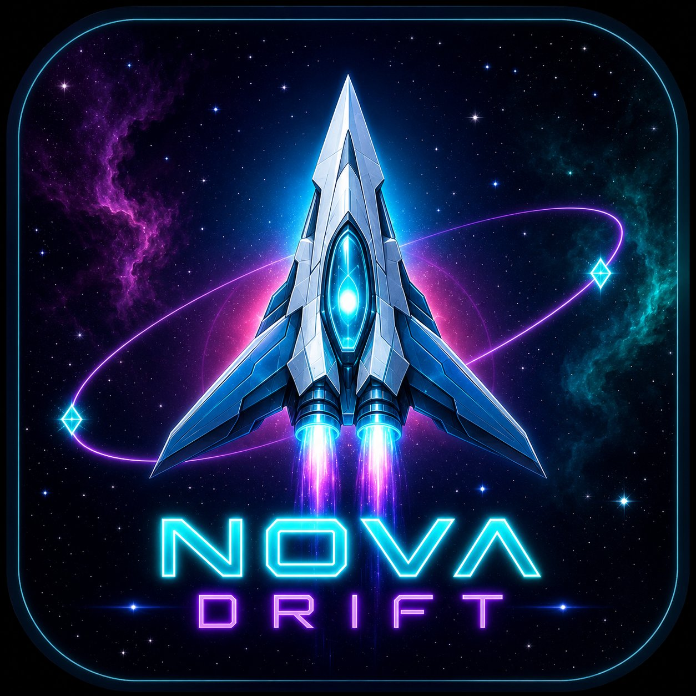

<div align="center">



# NOVA DRIFT

**Space Survival Shooter**

Pilot your fighter through endless waves of alien enemies and asteroid fields.  
Survive. Adapt. Set the record.


[▶ Play Live](https://smrafiu.github.io/Nova-Drift/) &nbsp;·&nbsp; [Report a Bug](https://github.com/YOUR_USERNAME/nova-drift/issues)

</div>

---

## About

**Nova Drift** is a fast-paced 2D space shooter built entirely with **vanilla JavaScript and HTML5 Canvas** — no libraries, no build tools, no dependencies. It runs in any modern browser and can be installed as a PWA on Android and iOS.

---

## Gameplay

- Your ship **auto-fires** — focus entirely on movement and survival
- Enemies spawn in **waves** that grow harder each round
- A **Boss** appears every 5th wave with multi-phase attack patterns
- Collect **gems** dropped by enemies for bonus score
- Grab **power-ups** to turn the tide
- Use the **Nova Bomb** to clear the screen when surrounded
- You have **3 lives** — lose them all and the mission ends

---

## Controls

### Mobile

| Action | How |
|--------|-----|
| Move ship | Choose a control mode in Settings (gear icon, top-left) |
| Nova Bomb | Canvas button — bottom-right of screen |
| Pause | Pause button — top-right of HUD |
| Settings | Gear icon — top-left of HUD |

### Desktop

| Action | Key |
|--------|-----|
| Move | `W A S D` or Arrow Keys |
| Nova Bomb | `Space` |
| Pause / Close | `Esc` |

---

## Control Modes

Switch anytime during gameplay via the **gear icon** (top-left). Preference is saved.

| Mode | How It Works |
|------|-------------|
| **Joystick** | Tap anywhere — a virtual joystick appears. Drag to steer. |
| **Drag Origin** | Touch and drag — ship moves relative to your start point. |
| **Follow Finger** | Ship flies directly toward wherever your finger is. |

---

## Enemies

| Type | Behaviour | Score |
|------|-----------|------:|
| Scout | Fast zigzag, aimed shots | 80 |
| Drone | Orbits player, continuous fire | 150 |
| Tank | Slow, heavy, shotgun spread | 300 |
| Boss | Wave 5, 10, 15… — spiral, ring, and targeted attacks | 800+ |

---

## Power-ups

| Icon | Name | Effect |
|------|------|--------|
| Purple shield | **Shield** | Absorbs all incoming damage until depleted |
| Gold bolt | **Rapid Fire** | Triple-shot spread for 7 seconds |
| Pink starburst | **Nova Bomb** | +1 bomb charge (max 5) |
| Green cross | **Repair** | Restores 1 life |

---

## Project Structure

```
nova-drift/
├── index.html              # All screens: Menu, Game, Pause, Wave Clear, Game Over, Settings
├── icon.png                # App icon — favicon, PWA icon, Apple touch icon
├── manifest.json           # PWA manifest — installable on Android & iOS
├── css/
│   └── style.css           # Full UI: dark neon space theme, animations, glassmorphism
└── js/
    ├── utils.js            # Math helpers, collision detection, localStorage, easing
    ├── particles.js        # Particle system: explosions, engine trails, sparks
    ├── entities.js         # Player, Bullet, Scout, Drone, Tank, Boss, Asteroid, Gem
    ├── powerups.js         # Power-up items drawn in Canvas 2D (no emoji)
    ├── input.js            # 3-mode touch control + keyboard input
    ├── audio.js            # Procedural sound effects via Web Audio API
    ├── game.js             # Core game loop, wave system, collision, canvas mobile UI
    ├── ui.js               # Screen manager, HUD updates, SVG lives, game-over animation
    └── main.js             # Entry point, button events, settings panel logic
```

---

## Running Locally

No build step required.

```bash
# Clone
git clone https://github.com/smrafiu/nova-drift.git
cd nova-drift

# Open directly in browser
open index.html

# Or use a local server (recommended — needed for Web Audio on some browsers)
npx serve .
# → http://localhost:3000
```

---

## Deploy to GitHub Pages

This repo includes a GitHub Actions workflow that deploys automatically on every push to `main`.

```bash
git init
git add .
git commit -m "Nova Drift v1.0"
git remote add origin https://github.com/smrafiu/nova-drift.git
git push -u origin main
```

Then go to: **Settings → Pages → Source: GitHub Actions**

Your game will be live at `https://smrafiu.github.io/nova-drift`

---

## Tech Stack

| Technology | Purpose |
|------------|---------|
| HTML5 Canvas 2D | Game rendering, mobile control UI |
| Vanilla JavaScript ES6+ | All game logic, OOP module pattern |
| CSS3 | UI screens, glassmorphism, keyframe animations |
| Web Audio API | Procedural sound effects (no audio files) |
| localStorage | High score + control mode preference |
| Google Fonts (Orbitron, Rajdhani) | Typography |
| GitHub Actions | Auto-deploy to GitHub Pages |

---

## Design

- **Palette:** Cyan `#00f0ff` · Magenta `#ff3cac` · Gold `#ffe066` · Purple `#a259ff`
- **Fonts:** Orbitron (headings) · Rajdhani (body)
- **Style:** Dark neon cyberpunk — all icons are inline SVG or Canvas 2D paths, zero emoji

---

## License

MIT — free to use, fork, and build on.

---

<div align="center">
Made by <strong>Rafiu</strong> &nbsp;·&nbsp; Pure JavaScript &nbsp;·&nbsp; No frameworks
</div>
